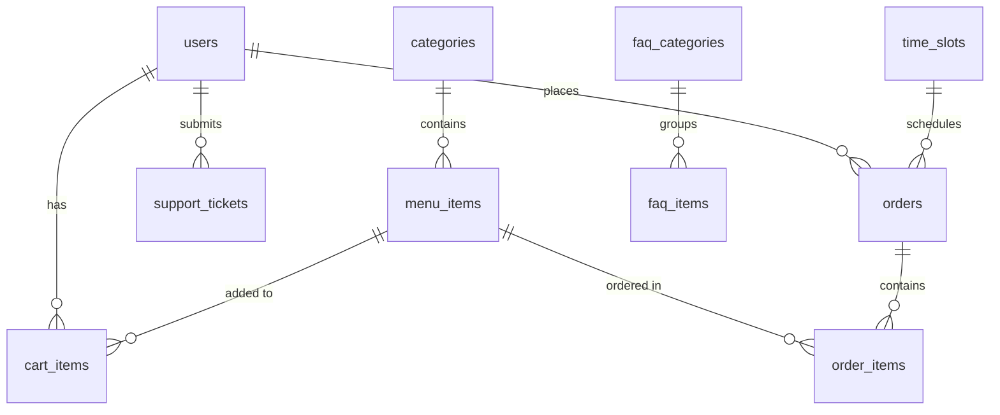

# OnFood Backend — Data Architecture & Vendor App Integration Guide

This document explains how data flows through the OnFood application, details the database structures, and provides guidelines for building a **Vendor (Kitchen/Admin) App** that connects to the Python server.

---

## Part 1: How Data is Handled

The application uses an asynchronous, database-driven architecture to manage the lifecycle of user actions, carts, and kitchen operations.

```
[Android Client] ──(HTTP JSON)──► [FastAPI Server] ──(SQLAlchemy Async)──► [PostgreSQL]
       │                                 ▲
       └───────────(SSE Stream)──────────┘ (Real-time Order Updates)
```

### 1. Stateless Authentication (JWT)
* Users log in with an email and password.
* The server verifies credentials and returns a JSON Web Token (JWT).
* The client must store this token locally (e.g., `EncryptedSharedPreferences` on Android) and send it in the `Authorization: Bearer <token>` header for all protected endpoints.
* The server decodes the token on every request to identify the user (`user_id`). No session is stored in memory on the server.

### 2. Per-User Persistent Cart
* Unlike simple e-commerce apps that store carts locally on the phone, OnFood persists cart items directly in PostgreSQL (`cart_items` table).
* This ensures that if a user switches devices or clears their app cache, their cart remains intact.
* Cart items are automatically validated against current prices and availability (`MenuItem.is_available`) during checkout.
* The cart is **automatically cleared** by the server once an order is successfully created.

### 3. Queue-Based ETA Calculation
* When a cart is checked out, the server calculates the preparation time dynamically:
  $$\text{Estimated Prep Time} = \max(\text{Selected Item Prep Times}) + (\text{Active Orders} \times \text{Kitchen Buffer})$$
* This is stored as `estimated_ready_at` (offset-naive UTC) in the database.

### 4. Daily Resetting Pickup Numbers
* Every order is assigned a sequential `pickup_number` (e.g. #1, #2, #3...) displayed to the user.
* A server service checks the current date: if it changes, the pickup counter resets back to `1`.

---

## Part 2: Database Schema & Structures

The PostgreSQL database contains 11 main tables. Below is the entity relation structure and descriptions.



### 1. User Management (`users`)
Stores customer account details.
* `id` (VARCHAR, PK): Matches the user's login ID.
* `name` (VARCHAR, Not Null): Full name of the user.
* `email` (VARCHAR, Unique, Indexed): User's email address.
* `phone` (VARCHAR, Nullable): Contact number.
* `hashed_password` (VARCHAR, Not Null): Bcrypt hashed password.

### 2. Menu Categories (`categories`)
Groups menu items for easy navigation.
* `id` (UUID, PK): Unique category ID.
* `name` (VARCHAR, Not Null): Category name (e.g., "Pizza", "Burgers").
* `icon_url` (VARCHAR, Nullable): Path to category icon.
* `display_order` (INTEGER, Default 0): Order of appearance in UI.
* `is_active` (BOOLEAN, Default True): Toggle visibility.

### 3. Menu Items (`menu_items`)
Individual food and beverage listings.
* `id` (UUID, PK): Unique item ID.
* `name` (VARCHAR, Not Null): Name of the dish.
* `price` (NUMERIC(10,2), Not Null): Active selling price.
* `original_price` (NUMERIC(10,2), Nullable): Price before discounts.
* `discount_percent` (NUMERIC(5,2), Nullable): Percent discount.
* `category_id` (UUID, FK -> `categories.id`): Associated category.
* `image_url` (VARCHAR, Nullable): Path to item photo.
* `is_special_offer` (BOOLEAN, Default False): Featured flag.
* `is_available` (BOOLEAN, Default True): Switch to turn item on/off.
* `preparation_time_minutes` (INTEGER, Default 10): Prep duration.

### 4. Time Slots (`time_slots`)
Available slots for scheduled orders.
* `id` (UUID, PK): Unique slot identifier.
* `start_time` (TIME, Not Null): Beginning of slot (e.g., `09:00:00`).
* `end_time` (TIME, Not Null): End of slot (e.g., `09:30:00`).
* `max_orders` (INTEGER, Default 5): Limit of orders per slot.
* `is_active` (BOOLEAN, Default True): Toggle slot availability.

### 5. Cart Items (`cart_items`)
Active shopping carts for each user.
* `id` (UUID, PK): Cart item ID.
* `user_id` (VARCHAR, FK -> `users.id`): Owner of the cart.
* `menu_item_id` (UUID, FK -> `menu_items.id`): Added menu item.
* `quantity` (INTEGER, Default 1): Selected quantity.
* `added_at` (TIMESTAMP, Not Null): Addition timestamp.

### 6. Orders (`orders`)
Customer purchase records.
* `id` (UUID, PK): Unique order identifier.
* `user_id` (VARCHAR, FK -> `users.id`): User who ordered.
* `total_amount` (NUMERIC(10,2), Not Null): Total paid amount.
* `status` (ENUM `order_status`): State of order.
  * Enums: `PLACED`, `SCHEDULED`, `PREPARING`, `READY_FOR_PICKUP`, `DELIVERED`
* `pickup_number` (INTEGER, Nullable): Resetting daily ID.
* `pickup_date` (DATE, Nullable): Date the number was issued.
* `estimated_ready_at` (TIMESTAMP, Nullable): Expected completion time.
* `actual_ready_at` (TIMESTAMP, Nullable): Actual completion time.
* `scheduled_date` (DATE, Nullable): Day of scheduling.
* `scheduled_slot_id` (UUID, FK -> `time_slots.id`, Nullable): Scheduled slot.
* `notes` (VARCHAR, Nullable): User instructions.
* `created_at` (TIMESTAMP, Default `now()`): Placement timestamp.

### 7. Order Items (`order_items`)
Line items inside a placed order.
* `id` (UUID, PK): Unique identifier.
* `order_id` (UUID, FK -> `orders.id`): Parent order.
* `menu_item_id` (UUID, FK -> `menu_items.id`): Ordered item.
* `quantity` (INTEGER, Not Null): Item count.
* `price_at_time_of_order` (NUMERIC(10,2), Not Null): Captured price when order was placed.

---

## Part 3: Vendor App Integration Hints

The **Vendor App** (Kitchen Dashboard / Owner App) is used by restaurant staff to process orders, toggle item availability, and control the kitchen. Here is how it should interact with the Python server.

### 1. How to Receive New Orders in Real-Time
To prevent kitchen staff from missing new orders, the Vendor App needs a real-time feed.

* **Option A: Admin SSE Stream (Recommended)**
  We can create a global Server-Sent Events endpoint: `GET /api/orders/stream/admin`. The Vendor App opens a single persistent connection, and the server pushes a message every time a new order is `PLACED` or `SCHEDULED`.
* **Option B: Polling (Fallback)**
  If SSE is not used, the Vendor App can poll the active orders endpoint every 10 seconds:
  ```http
  GET /api/orders/history?status=PLACED&status=SCHEDULED&status=PREPARING
  ```

### 2. Managing the Order Status Lifecycle
Kitchen staff move orders through the pipeline by calling the status update endpoint:
```http
PATCH /api/orders/{orderId}/status
Content-Type: application/json
Authorization: Bearer <vendor_token>

{
  "status": "PREPARING"
}
```

#### Recommended UI Flows for Staff:

```
[ New Orders Column ]          [ Kitchen Cooking ]          [ Ready / Pickup Column ]
┌─────────────────────┐       ┌─────────────────────┐       ┌──────────────────────┐
│ Order #12 - PLACED  │       │ Order #10 -PREPARING│       │ Order #9 - READY     │
│ 1x Margherita Pizza │ ───►  │ 2x Cheeseburger     │ ───►  │ 1x Chocolate Cake    │
│                     │       │                     │       │                      │
│ [ START PREPARING ] │       │ [ MARK AS READY ]   │       │ [ HAND OVER TO CUST ]│
└─────────────────────┘       └─────────────────────┘       └──────────────────────┘
```

1. **New Order Arrives (`PLACED` status)**: 
   * Play a notification sound.
   * Display items and customer notes.
   * Staff clicks **"Start Preparing"** → calls `PATCH /status` with `"PREPARING"`. This fires an SSE update to the customer.
2. **Food is Done (`READY_FOR_PICKUP` status)**:
   * Staff clicks **"Mark as Ready"** → calls `PATCH /status` with `"READY_FOR_PICKUP"`.
   * Customer gets a push/SSE alert: *"Your order is ready! Show #XX at the counter"*.
3. **Customer Picks Up Food (`DELIVERED` status)**:
   * Customer shows their pickup number at the counter.
   * Staff hands over the food and clicks **"Complete / Delivered"** → calls `PATCH /status` with `"DELIVERED"`. The order is archived in history.

---

### 3. Handling Scheduled Orders
* Scheduled orders start in `SCHEDULED` status.
* The Vendor App should have a separate **"Future Scheduled Orders"** tab grouped by time slots (e.g. *12:30 PM - 01:00 PM: 3 Orders booked*).
* A countdown timer can show when prep must start. For example, if an order has a 15-minute prep time and is scheduled for `12:30 PM`, the Vendor App highlights the order at `12:15 PM` prompting staff to move it to `PREPARING`.

---

### 4. Kitchen Control & Inventory Toggles
The Vendor App needs to change settings on the fly.

* **Out of Stock**: If the kitchen runs out of onions, the staff needs to toggle a menu item off:
  ```http
  PATCH /api/admin/menu/{itemId}
  { "isAvailable": false }
  ```
  *This instantly prevents customers from adding it to their carts or checking out.*
* **Kitchen Overload (Kitchen Settings)**: If orders pile up, the staff can increase the delay buffer or temporarily close the kitchen:
  ```http
  PATCH /api/admin/kitchen/settings
  {
    "basePrepBufferMinutes": 5,   // increases calculated ETA for new orders
    "isAcceptingOrders": false    // customer checkout gets rejected with "Kitchen closed"
  }
  ```

### 5. Vendor API Reference Checklist

| Task | HTTP Method | Route | Request Body |
|---|---|---|---|
| Get active orders queue | `GET` | `/api/orders/history?status=PLACED&status=SCHEDULED&status=PREPARING` | None |
| Start cooking order | `PATCH` | `/api/orders/{id}/status` | `{"status": "PREPARING"}` |
| Finish cooking (ready) | `PATCH` | `/api/orders/{id}/status` | `{"status": "READY_FOR_PICKUP"}` |
| Hand over to customer | `PATCH` | `/api/orders/{id}/status` | `{"status": "DELIVERED"}` |
| Pause all online orders | `PATCH` | `/api/admin/kitchen/settings` | `{"isAcceptingOrders": false}` |
| Toggle item out of stock | `PATCH` | `/api/admin/menu/items/{id}` | `{"isAvailable": false}` |
