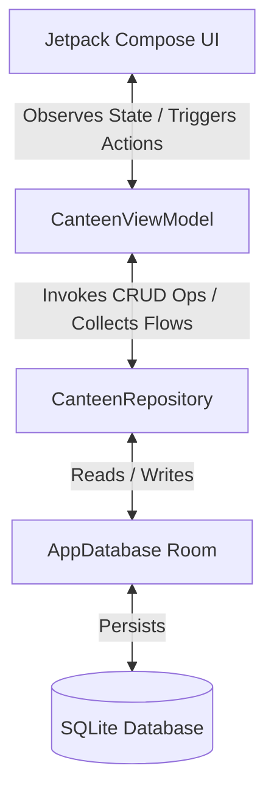

# Data Handling and Integration Guide

This guide explains how data is structured, stored, and managed in the canteen application, and details the current and potential methods for sending external data to the app.

---

## 1. System Architecture & Data Flow Overview

The application is built as an offline-first Android app using **Jetpack Compose** for the user interface, **Room (SQLite)** for local persistence, and follow-through of the **MVVM (Model-View-ViewModel)** architectural pattern.

### Architecture Layering



1. **Local SQLite Database**: Stores the persistent state of menu items, staff, orders, and preferences.
2. **Repository Layer**: Acts as the single source of truth, manages database operations, and initiates the default database seeding when the app launches.
3. **ViewModel Layer**: Exposes database flows as state observables (`StateFlow`) to Compose screens, keeping the UI in sync.
4. **UI Layer**: Composed of Jetpack Compose screens that respond to changes in the database and capture user inputs to dispatch updates back to the database.

---

## 2. Current Data Models & Local Storage

The local database configuration is defined in:
* [Entities.kt](file:///c:/Users/karth/OneDrive/Desktop/onfood/xml-modular-framework/app/src/main/java/com/example/data/Entities.kt) (Data tables definition)
* [AppDatabase.kt](file:///c:/Users/karth/OneDrive/Desktop/onfood/xml-modular-framework/app/src/main/java/com/example/data/AppDatabase.kt) (Room DB and DAOs configuration)
* [CanteenRepository.kt](file:///c:/Users/karth/OneDrive/Desktop/onfood/xml-modular-framework/app/src/main/java/com/example/data/CanteenRepository.kt) (Data access repository)

### The Data Models

The app handles four core entities:

| Entity / Table | Primary Key | Key Fields | Purpose |
| :--- | :--- | :--- | :--- |
| **`UserPreference`** (`user_preferences`) | `key: String` | `value: String` | Local configuration (theme, sound level, operational hours, active canteen name). |
| **`StaffMember`** (`staff_members`) | `id: Int` (Auto) | `name`, `role`, `status`, `imageUrl` | List of active/on-duty employees. |
| **`MenuItem`** (`menu_items`) | `id: Int` (Auto) | `name`, `category`, `price`, `stock`, `imageUrl`, `description`, `prepTime`, `isStudentVisible` | Canteen menu items and stock controls. |
| **`Order`** (`orders`) | `id: Int` (Auto) | `token`, `studentName`, `rollNo`, `branch`, `itemsSummary`, `totalAmount`, `status`, `placedTime`, `timestamp` | Customer orders, statuses (`Incoming`, `Preparing`, `Ready`, `Completed`, etc.). |

---

## 3. How Data is Handled (Read/Write Flows)

### A. Initial Database Seeding
When the application starts up inside [CanteenApplication.kt](file:///c:/Users/karth/OneDrive/Desktop/onfood/xml-modular-framework/app/src/main/java/com/example/CanteenApplication.kt), it triggers an asynchronous database seed check:

```kotlin
override fun onCreate() {
    super.onCreate()
    val applicationScope = CoroutineScope(SupervisorJob())
    applicationScope.launch {
        repository.checkAndSeedDatabase()
    }
}
```

In [CanteenRepository.kt](file:///c:/Users/karth/OneDrive/Desktop/onfood/xml-modular-framework/app/src/main/java/com/example/data/CanteenRepository.kt):
1. The app queries the local database to see if preferences, staff, menu items, or orders are empty.
2. If empty, it populates them with hardcoded default values (e.g., sample burgers, sample orders like `Rahul Sharma`, and default preferences).

### B. Displaying Data to the UI (Reactive Pipeline)
Data updates flow reactively using Kotlin Coroutines `Flow`:
1. The Room database outputs a `Flow<List<T>>` when tables change.
2. [CanteenRepository.kt](file:///c:/Users/karth/OneDrive/Desktop/onfood/xml-modular-framework/app/src/main/java/com/example/data/CanteenRepository.kt) exposes these streams:
   ```kotlin
   val allOrders: Flow<List<Order>> = orderDao.getAllOrdersFlow()
   ```
3. [CanteenViewModel.kt](file:///c:/Users/karth/OneDrive/Desktop/onfood/xml-modular-framework/app/src/main/java/com/example/ui/CanteenViewModel.kt) transforms these cold flows into hot `StateFlow` instances:
   ```kotlin
   val allOrders: StateFlow<List<Order>> = repository.allOrders.stateIn(
       scope = viewModelScope,
       started = SharingStarted.WhileSubscribed(5000),
       initialValue = emptyList()
   )
   ```
4. The Compose UI screens (e.g. [DashboardScreen.kt](file:///c:/Users/karth/OneDrive/Desktop/onfood/xml-modular-framework/app/src/main/java/com/example/ui/DashboardScreen.kt)) observe this state using `.collectAsState()` and automatically re-render when the database is updated.

### C. Modifying Data (Write/Update Pipeline)
When a user updates a menu item, transitions an order status, or adds a staff member:
1. The Jetpack Compose UI triggers a method in [CanteenViewModel.kt](file:///c:/Users/karth/OneDrive/Desktop/onfood/xml-modular-framework/app/src/main/java/com/example/ui/CanteenViewModel.kt) (e.g., `updateOrderStatus(orderId, newStatus)`).
2. The ViewModel launches a coroutine to execute the operation on the background thread:
   ```kotlin
   fun updateOrderStatus(orderId: Int, newStatus: String) {
       viewModelScope.launch {
           repository.updateOrderStatus(orderId, newStatus)
       }
   }
   ```
3. The repository calls Room database DAO functions to execute a SQL `UPDATE` / `INSERT` query.
4. Room automatically emits the updated list to the active Flow, updating the UI instantly.

---

## 4. How to Send Data to this App

Currently, the application is **purely local** (data exists only on the device inside the Room SQLite database). To connect external clients (such as a student ordering app or a centralized web panel) and send data to this app, you can use several patterns.

Since libraries like **Retrofit, OkHttp, Moshi, and Firebase** are already pre-configured in [build.gradle.kts](file:///c:/Users/karth/OneDrive/Desktop/onfood/xml-modular-framework/app/build.gradle.kts), you have several ready-to-implement options:

### Method A: Fetching Data via REST API / HTTP Polling (Pull Method)
If you host a centralized web server that receives orders from students, the canteen app can fetch (pull) orders periodically.

**Implementation Steps:**
1. Define a Retrofit API service to fetch new orders or menu items:
   ```kotlin
   interface CanteenApiService {
       @GET("canteen/orders")
       suspend fun getNewOrders(): List<OrderNetworkModel>
   }
   ```
2. In [CanteenRepository.kt](file:///c:/Users/karth/OneDrive/Desktop/onfood/xml-modular-framework/app/src/main/java/com/example/data/CanteenRepository.kt), create a synchronization function to download orders and write them to the local database:
   ```kotlin
   suspend fun syncOrdersWithServer(apiService: CanteenApiService) {
       try {
           val networkOrders = apiService.getNewOrders()
           for (netOrder in networkOrders) {
               // Map and insert/update in local Room DB
               val localOrder = Order(
                   token = netOrder.token,
                   studentName = netOrder.studentName,
                   rollNo = netOrder.rollNo,
                   branch = netOrder.branch,
                   itemsSummary = netOrder.itemsSummary,
                   totalAmount = netOrder.totalAmount,
                   status = netOrder.status,
                   placedTime = netOrder.placedTime
               )
               orderDao.insertOrder(localOrder)
           }
       } catch (e: Exception) {
           // Handle connection failure/log error
       }
   }
   ```
3. Call this function periodically (e.g., using Android **WorkManager** or a repeating Coroutine timer in the ViewModel).

---

### Method B: Real-Time Sync using Cloud Firestore (Real-time Push/Pull Method)
If you want instant order propagation without manual polling, you can use Firebase Firestore.

**Implementation Steps:**
1. Uncomment `implementation(libs.firebase.firestore)` in [build.gradle.kts](file:///c:/Users/karth/OneDrive/Desktop/onfood/xml-modular-framework/app/build.gradle.kts).
2. Set up a Firebase project and add the `google-services.json` file in `app/`.
3. In [CanteenRepository.kt](file:///c:/Users/karth/OneDrive/Desktop/onfood/xml-modular-framework/app/src/main/java/com/example/data/CanteenRepository.kt), subscribe to a Firestore collection (e.g., `orders`) so the app gets notified the millisecond an order is created:
   ```kotlin
   fun listenForRemoteOrders() {
       val db = Firebase.firestore
       db.collection("orders")
           .whereEqualTo("canteenId", "kitchen_flow")
           .addSnapshotListener { snapshots, e ->
               if (e != null) return@addSnapshotListener
               
               for (doc in snapshots!!.documentChanges) {
                   if (doc.type == DocumentChange.Type.ADDED) {
                       val order = doc.document.toObject(Order::class.java)
                       // Save directly to the local Room database to update UI
                       CoroutineScope(Dispatchers.IO).launch {
                           orderDao.insertOrder(order)
                       }
                   }
               }
           }
   }
   ```

---

### Method C: Firebase Cloud Messaging (FCM) Push Notifications
For larger scale applications, you can notify the device when new data is available using push notifications.

**Implementation Steps:**
1. Integrate Firebase Cloud Messaging.
2. When a student places an order on their app, your backend server sends a high-priority data message notification to the canteen app's token.
3. In the canteen app's `FirebaseMessagingService`, capture the data payload:
   ```kotlin
   class MyFirebaseMessagingService : FirebaseMessagingService() {
       override fun onMessageReceived(remoteMessage: RemoteMessage) {
           // 1. Parse the order from payload
           // 2. Insert the order directly into the local database
           // 3. (Optional) Print ticket or trigger a sound notification
       }
   }
   ```

---

### Method D: Local Area Network (Wi-Fi) Socket or Server (Direct Peer-to-Peer)
If the canteen operations are on a local intranet/Wi-Fi and you want to bypass the internet:

**Implementation Steps:**
1. Embed a lightweight HTTP server library like **Ktor Server** or **NanoHTTPD** inside the Android application.
2. Start the server on a background thread when the app launches (e.g., listening on port `8080`).
3. Student devices on the same Wi-Fi connection can discover the canteen's local IP address and send HTTP POST requests directly to `http://<device-ip>:8080/order`.
4. The embedded server handles the POST request, deserializes the JSON body into an `Order` object, and saves it into the Room DB.

---

## 5. Summary of Where Code Changes are Needed

If you are extending this app to support external data ingestion, here is where to place your edits:

* **To add network model parsing**: Create a new file in `data/Models.kt` or `data/NetworkModels.kt`.
* **To add API connection configuration**: Create an API folder `data/api/` containing Retrofit builders and endpoint declarations.
* **To perform syncing**: Add methods in [CanteenRepository.kt](file:///c:/Users/karth/OneDrive/Desktop/onfood/xml-modular-framework/app/src/main/java/com/example/data/CanteenRepository.kt) to insert retrieved items into database DAOs.
* **To enable background syncing**: Define a `CoroutineWorker` using Android's WorkManager framework.
